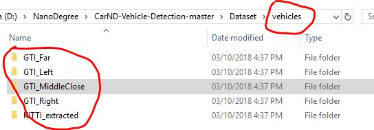
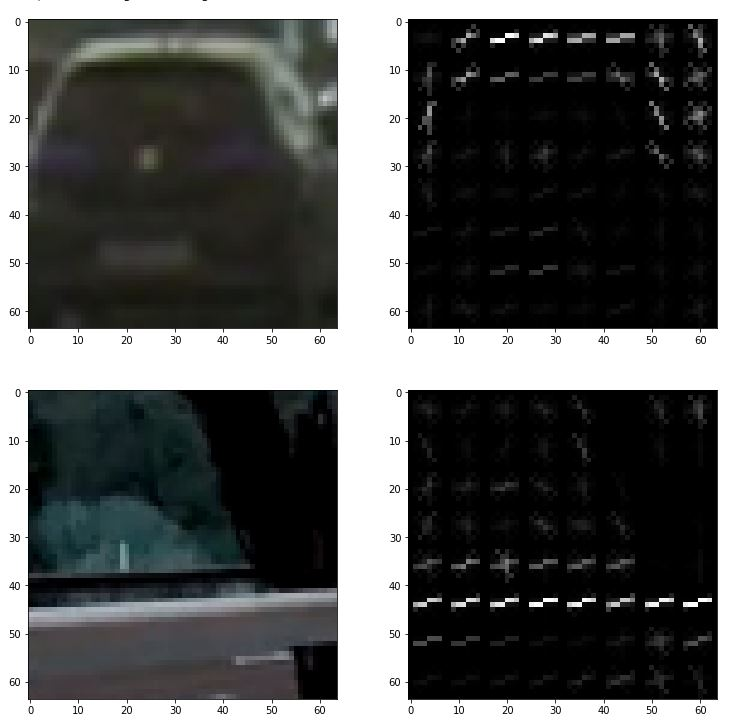
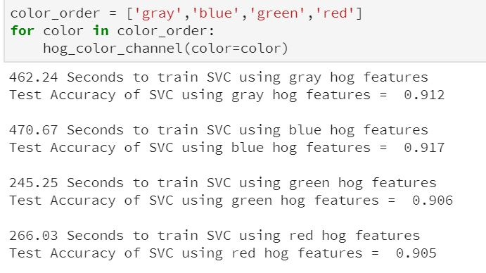
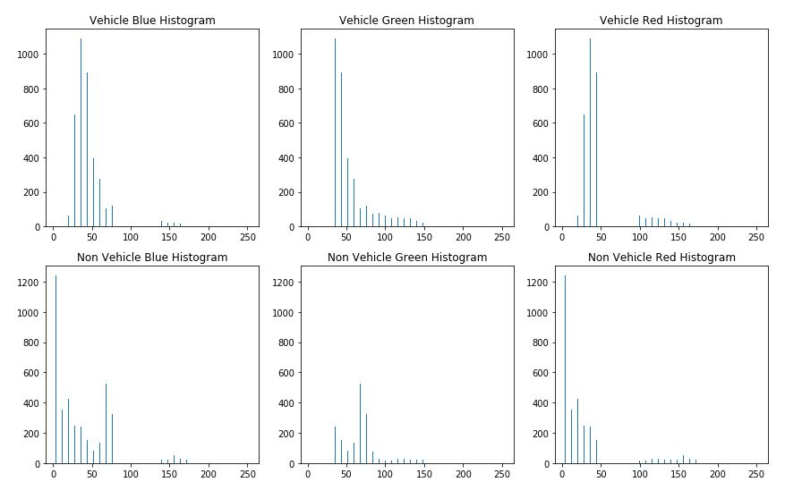
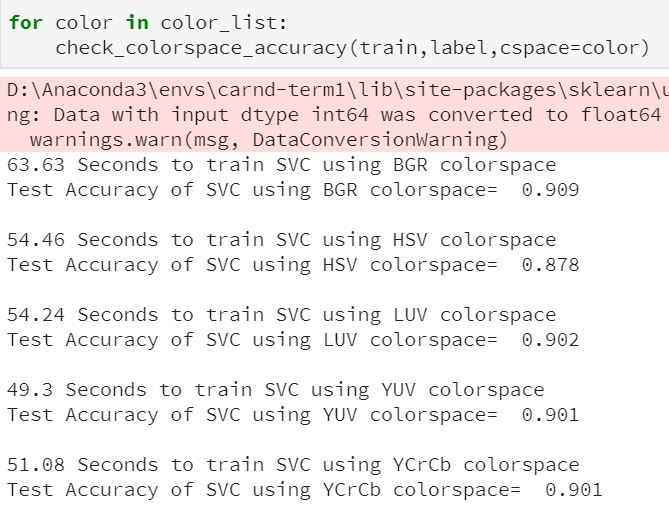
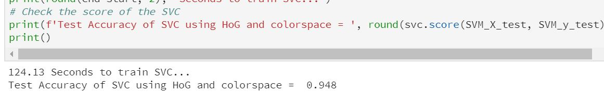
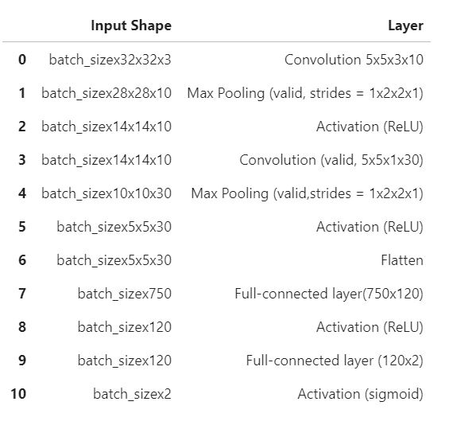
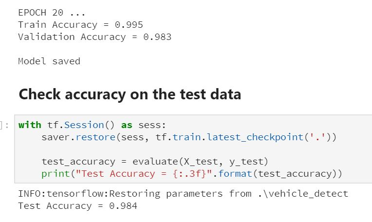
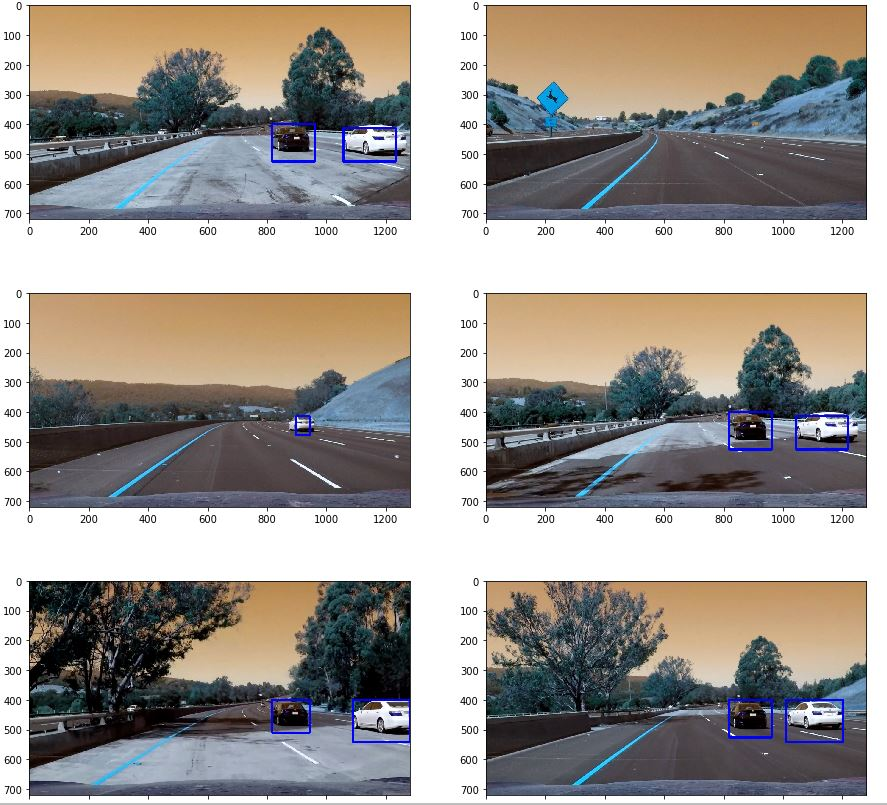

# Vehicle Detection

**Vehicle Detection Project**

The goals / steps of this project are the following:

* Perform a Histogram of Oriented Gradients (HOG) feature extraction on a labeled training set of images and train a classifier Linear SVM classifier
* Perform colorspace feature extraction  
* Normalize your features and randomize a selection for training and testing.
* Train a classifier Linear SVM classifier
* Train a CNN classifier without any manual feature extraction
* Compare the accuarcy of linear SVM and CNN classifier
* Implement a sliding-window technique and use the 2 indepedent trained classifiers to search for vehicles in images. Only the windows in which both classifiers predict to contain vehicle are kept. 
* Create a heat map of recurring detections frame by frame to reject outliers and follow detected vehicles.
* Estimate a bounding box for vehicles detected.

##### Pipeline: 
1. Import all the train dataset

2. Process the images with HOG and colorspace feature extraction

3. Train linear SVM classifier using the processed feature extraction

4. Train CNN classifier using images

5. Compare the accuracy of these 2 models.

6. Create sliding windows with varied size to identify vehicle in the image. For the purpose of conservativeness, both CNN and SVM are used to predict vehicles. 

7. Create heatmap to remove false positive and duplicate sliding windows.

---

